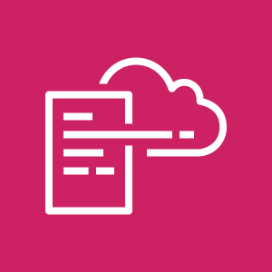
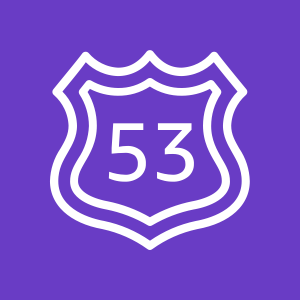
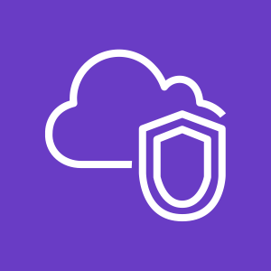
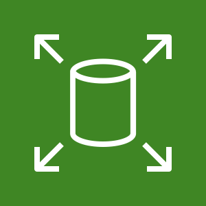
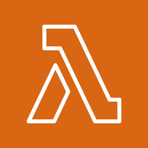
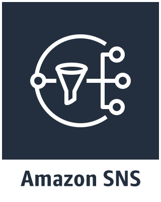
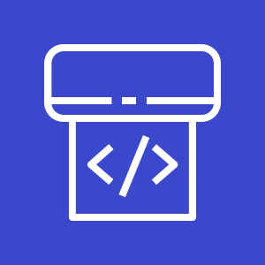

# A CloudFormation Template for Deploying an Ad-Blocking DNS Server

## Table of contents

1. [Project Outline](#Outline)
    - [Project Progress](#Progress)
    - [Key Technologies](#Technologies)
    - [A Note About Open Resolvers](#Resolver)
2. [Installation](#Installation)
    - [Before You Begin](#Begin)
    - [Running the Template](#Run)
    - [Client Configuration](#Client)
3. [Template Details](#Details)
    - [Workflow](#Workflow)
    - [Parameters](#Parameters)
4. [Troubleshooting](#Troubleshooting)
5. [Limitations](#Limitations)
6. [Roadmap](#Roadmap)
7. [Reference](#Reference)
---

## Project Outline

This project is for a CloudFormation template that automates the creation of a DNS server. It uses docker to deploy a Pi-hole ad-blocking DNS relay secured by a split tunnel VPN to prevent it from becoming an open resolver. The benefit is a standardized ad-blocking environment that can be applied to an entire home network as well as on your cell phone for secure ad-blocking while on the go.

The primary goal is ad-blocking but this system provides additional benefits as well. Many security exploits rely on advertising platforms for attack vectors so it's best practice to block them by default. Additional saftey is provided by using a secure DNS server that is more difficult to hijack to reduce phishing. Privacy is another consideration that is improved because DNS traffic will no longer be logged by your ISP. Finally, you will reduce your bandwidth usage by blocking marketing videos and images.

Based on the DevOps theory of infrastructure as code, this AWS CloudFormation template is an automated and portable process that anybody can run. I made this template to apply the knowledge I gained while becoming an AWS Certified Cloud Architect Associate. The stack is fully automated and persistent which means that everything is created at run time and all configurations are saved so it can be reused for redeployment.

#### Project Progress
- 2.1 update:
  - Improved IAM policies.
  - Added an S3 bucket policy.
  - Fixed another issue with a hard coded parameter.
- 2.0 update:
     - The entire stack is fully automated *and* persistent!
     - Designed a CloudFormation Interface for organized configuration.
     - Additional security by obscuring passwords and encrypting the EBS mount.
     - Added cfn-init for software configuration and deployment.
     - S3 bucket for easy access to the client certificate.
     - Lambda function to delete the S3 bucket.
     - Added parameters home or mobile deployment.
     - Fixed an issue with a hard coded parameter.

#### Key Technologies

This project is a CloudFormation template coded in YAML. I’m leveraging the following AWS services:

 
 

 
 

  
Docker containers are used for ease of management.

  
Pi-hole is an open source dns server that acts as a relay and blocks ads based on black and white lists. It was originally designed for the Raspberry Pi so it's extremely lightweight and fast.
    
 
 
OpenVPN is the standard in open source VPN tunnels. This project configures it as a split tunnel so it only routes DNS queries and allows you to maintain optimal performance for all other network communications.

  
Watchtower monitors the docker repository for changes and restarts the containers so that the stack remains updated.
   

#### A Note About Open Resolvers

A DNS server that responds to all clients is called an [Open Resolver](http://openresolverproject.org/). This presents a significant security risk to you and others on the internet. This project is designed to be secure by using a VPN tunnel to the DNS server. Additionally, Pi-hole in this stack is configured for interface listening one hop away so it won't respond to outside requests.

---

## Installation

This section describes how to deploy the stack. Resource creation, key creation, and system configuration is automated to minimize preparation.

#### Before You Begin

Using this template requires the following:
- An AWS account.
- A Key Pair to associate with the EC2 instance for ssh connections.
- A domain registered on Route 53.

#### Running the Template

Follow these steps to successfully run the CloudFormation template. Steps 1-3 only need to be performed once to build out the environment.

 1. *Select Template*
     - Choose "Upload the template to Amazon S3" and then specify the file location.
 2. *Enter the desired parameters (See the [Parameters](#Parameters) section below)*
     -  At minimum, you will need to specify the following:
	      - Stack name
	      - KeyPair
	      - Route 53 Zone ID
	      - Domain Name
	      - Availability Zone
 3. *Select Options*
     - You can leave the defaults but for troubleshooting issues go to advanced and disable "Rollback on failure".
 4. *Review*
     - Scroll to the bottom and check the box, "I acknowledge that AWS CloudFormation might create IAM resources".
 5. *Create*
     - Click "Create" and wait for the stack to build. It will take 5-10 minutes to complete. When it's finished, the status will say "CREATE_COMPLETE".

#### Client Configuration

As part of the stack creation, an S3 bucket is created that contains the client key. You can find a link to it in the Resources tab in CloudFormation.

- Copy the ovpn file your client computer (or phone) and import it into your VPN application.
- I'm using OpenVPN on my desktop.
- Some routers support VPN connections and you can import the key to provide ad-blocking for your entire network.
- There are several OpenVPN applications for phones. On Android, you want the one exactly named "OpenVPN for Android". This one allows you to exclude the Google Play Store so that application updates will continue to work.
     - In OpenVPN for Android, click on the edit icon for the connection, navigate to "Allowed Apps", and check the box next to "Google Play Store".
---

## Template Details

This section describes the behavior of the Cloudformation template as well as the available parameters that you can specify at launch.

#### Workflow

1. The template creates a VPC with a subnet.
2. An Internet Gateway, route table, and Elastic IP are attached to give the network a static route to the internet.
3. A security group is created with ACLs for the appropriate ports and attached to the Elastic IP.
4. Next, an IAM role is created to grant access to the EC2 instance.
5. Route53 is configured to provide an A record to the Elastic IP.
6. An S3 bucket is created that will store the client key and logs.
7. The EBS volume that will be used for the bind mount is created. If you specified an EBS snapshot then it will be built from it so that your settings persist from a previous stack.
8. Finally, the EC2 instance is created.
     - The EBS Volume is attached for the Docker bind mount.
     - User Data is used to run a startup script to:
          - Install Docker.
          - Update the OS.
		  - Run the cnf-init config set. The config set contains all of the software configuration.
		       - Mount the EBS volume.
		       - Generate the CA key if you don't specify an EBS snapshot.
		       - Run the docker containers Pi-hole, OpenVPN, and Watchtower.
		       - Generate a client key if you don't specify an EBS snapshot.
		       - Copy logs and the client key to the S3 bucket.

#### Parameters

These are the parameters used by the stack. Some are optional depending on your configuration. After you load the template into CloudFormation, you will be presented with a page requesting the following.

##### Software Configuration
- *Reuse EBS Snapshot:* (Optional) You can leave this blank the first time you run the stack. If you wish to redeploy, put snapshot id here to load it. This will allow you to reuse your keys from previous deployments.
- *Pi-hole Password:* password for logging into the Pi-hole dashboard.

##### EC2 Configuration
- *EC2 Instance Type:* (Default: t3.nano) The EC2 instance type that determines the CPU and memory configuration. The default t3.nano is the smallest and cheapest option and is more than capable for this application. If you are still within the first year of your AWS free tier then a t2.micro would be cheaper.
- *AMI Id:* (Default: /aws/service/ami-amazon-linux-latest/amzn2-ami-hvm-x86_64-gp2) This is the Amazon Machine Image, the base operating system and version that will be used to create your EC2 instance.  The default is configured to grab the latest version of Amazon Linux2. You could specify a different AMI but it may require different User Data values depending on the installed software.
- *KeyPair:* (Required) This is your key pair that is used when making an SSH connection to an EC2 instance. You will need to have created this before hand.

##### Network Configuration
- *Route 53 Zone ID:* (Required) The Route 53 ZoneId for the domain you will associate with the server.
- *Domain Name:* (Required) The name of A record for you EC2 instance, for example, pihole.exammple.com
- *Client CIDR:* (Default: 0.0.0.0/0) The CIDR IP granted access by the Security Group. You can limit this to a specific IP but most people are behind DHCP. You could also specify a range used by your ISP to limit access. The default accepts all IPs.
- *Availability Zone:* (Required) The availability zone for the subnet where the EC2 instance will be created. It must match the location of your EBS volume.

##### VPN Configuration
- *Client Key:* The file name for the client key.
- *Root Certificate Key:* The password for the root certificate.
- *Certificate Authority Common Name:* This is the name of the certificate, typically corresponding with the name of the service.
- *OpenVPN UDP Port:* (Default 1194) This is the VPN Port you will be using. 1194 is the default but it’s more secure to change this to something else.
- *Home Network:* (Optional) You can leave this field blank if you are using the cert for your phone. Otherwise, this will have to be populated with your home network range so that a route is provided to the gateway. *Example: 192.168.0.0 or 10.0.0.0*
- *Home Subnet:* (Optional) You can leave this field blank if you are using the cert for your phone. Otherwise, this will have to be populated with your home subnet range so that a route is provided to the gateway. *Example: 255.255.255.0*

## Troubleshooting

- I have discovered a new issue with Android Pie, the latest version of the Android operating system. Google added a new feature in Chrome called "Async DNS resolver" that ignores your DNS settings and forwards queries to Google instead. The issue is documented [here](https://www.androidsage.com/2018/01/25/how-to-fix-adhell-2-not-working-chrome/). This issue can be solved with the following Steps:
  - Launch Chrome
  - Enter the URL "chrome://flags"
  - search for "dns"
  - Set "Async DNS resolver" to "Disabled"
  - Click on "RELAUNCH NOW" to restart your browser

- Some EC2 instance types aren't available in all Availability Zones. If the template fails because the instance type is unavailable you can either select a different zone or instance type like t2.micro.
- If the stack fails to build, it automatically rolls back so that you can't view the logs. To prevent this, you can disable "Rollback on failure" in the Advanced section of the Options page. This will allow you to ssh into the EC2 instance and view the logs. The two logs that I find most valuable are the cfn-init.log which shows the software being configured and cloud-init-output.log that shows the stack creation.	 
- The most difficult part I encountered is correctly configuring the VPN routes so that the tunnel is correctly split and only forwards DNS traffic. For this reason, I created the Home Network and Home Subnet parameters that could be modified. I haven't tested it yet but I believe if you configure the tunnel on your router then you'll need to change these to reflect your WAN IP. I also determined that these values aren't required for phones.
- If you receive a TLS error then it's probably an issue with the route on your local network. If the DNS isn't resolving then it's probably and issue with the route to your DNS server. You can view your route configuration in the following location:

      /mnt/dockershare/ovpn-data/openvpn.conf
---

## Limitations

- This project relies on a domain registered on Route 53 which is an additional expense. I intend to make this optional in future updates.

---

## Roadmap

*Encryption and security*
- Add [unbound](https://nlnetlabs.nl/projects/unbound/about/) for additional security and privacy.

- SSL with AWS Certificate manager in the CloudFormation template.

*Monitoring and Notifications*
- SNS alerts for reporting changes and issues.

- CloudWatch monitoring configured in the CloudFormation template.

*Additional Templates*
- My next project will be to create a CD pipeline CloudFormation template for AWS CodePipeline.

- I think I want to expand this project to include an ELB and autoscaling.

---

## Reference

I'm using the following Docker containers in this project:
- [pschiffe/docker-openvpn](https://github.com/pschiffe/docker-openvpn) which is based on [kylemanna/docker-openvpn](https://github.com/kylemanna/docker-openvpn)
- [pihole/pihole](https://github.com/pi-hole/docker-pi-hole)
- [v2tec/watchtower](https://github.com/v2tec/watchtower)

I found a number of valuable sources when researching this project:

- This issue describes how to configure split tunnel for DNS routing.
https://github.com/kylemanna/docker-openvpn/issues/288

- This is a 3 part series on creating an OpenVPN CloudFormation template and was the original base for my template.
https://zugdud.io/index.php/2017/11/16/automate-the-creation-of-a-basic-vpc-with-cloudformation/

- This is a pi-hole CloudFormation template that inspired me to containerize everything.
https://blog.observian.com/cloudformation-pi-hole-and-you
