# A CloudFormation Template for Deploying an Ad-Blocking DNS Server

## Table of contents
<a href="https://aws.amazon.com/cloudformation/">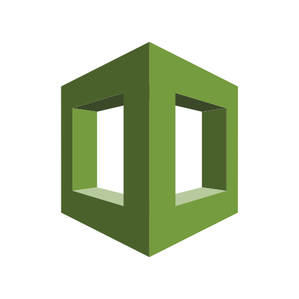</a>
1. [Project Outline](#Outline)
    - [Project Progress](#Progress)
    - [Key Technologies](#Technologies)
    - [A Note About Open Resolvers](#Resolver)
2. [Installation](#Installation)
    - [Before You Begin](#Begin)
    - [Running the Template](#Run)
    - [Client Configuration](#Client)
3. [Template Details](#Details)
    - [Workflow](#Workflow)
    - [Parameters](#Parameters)
4. [Troubleshooting](#Troubleshooting)
5. [Limitations](#Limitations)
6. [Roadmap](#Roadmap)
7. [Reference](#Reference)
---

## Project Outline

This project is for a CloudFormation template that uses docker to create a Pi-hole ad-blocking DNS relay. It's secured by a split tunnel VPN to prevent it from becoming an open resolver. The benefit is a standardized ad-blocking environment that can be applied to an entire home network as well as on your cell phone for secure ad-blocking while on the go. The goal is to set up a VPN connection that only routes DNS traffic to maintain performance with a low cost EC2 instance.

Based on the DevOps theory of infrastructure as code, I'm using an AWS CloudFormation template make an automated and portable process that anybody can run. I made this template to apply the knowledge I gained while becoming an AWS Certified Cloud Architect Associate. Currently, the project is a work in progress and the entire deployment is not automated.

#### Project Progress
- All of the infrastructure is automated except for the EBS volume used for a persistent blind mount.
- All of the software is automated except for VPN key generation.

#### Key Technologies

<a href="https://aws.amazon.com/">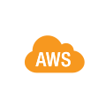</a>

This project is a CloudFormation template coded in YAML. I’m leveraging the following AWS services:

<a href="https://aws.amazon.com/cloudformation/">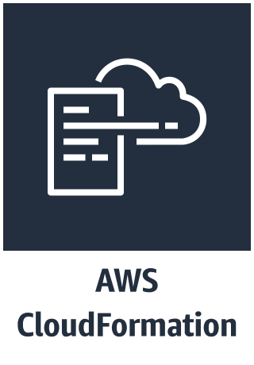</a> <a href="https://aws.amazon.com/route53/">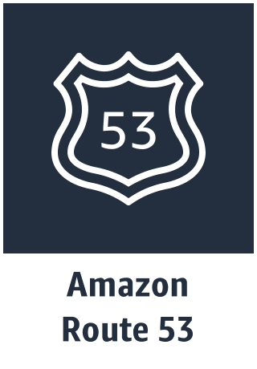</a>

 <a href="https://aws.amazon.com/ec2/">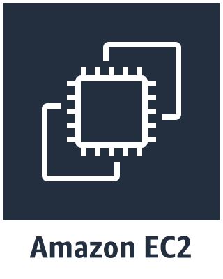</a>

<a href="https://aws.amazon.com/iam/">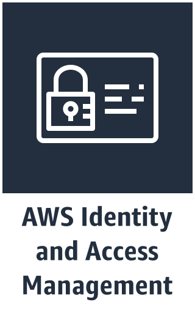</a> <a href="https://aws.amazon.com/ebs/">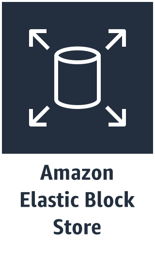</a>

<a href="https://www.docker.com/">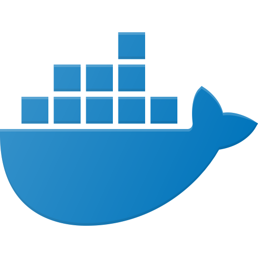</a>
  
Docker containers are used for ease of management.

  
Pi-hole is an open source dns server that acts as a relay and blocks ads based on black and white lists. It was originally designed for the Raspberry Pi so it's extremely lightweight and fast.
    
 
 
OpenVPN is the standard in open source VPN tunnels. This project configures it as a split tunnel so it only routes DNS queries and allows you to maintain optimal performance for all other network communications.

<a href="https://github.com/v2tec/watchtower">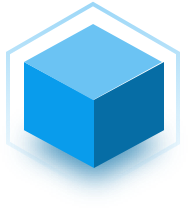</a>
  
Watchtower monitors docker images and restarts the containers so that the stack remains updated.
   

#### A Note About Open Resolvers

A DNS server that responds to all clients is called an [Open Resolver](http://openresolverproject.org/). This presents a significant security risk to you and others on the internet. OpenVPN helps to prevent this risk by providing a private tunnel to the DNS server. Additionally, Pi-hole's default configuration for interface listening should not be modified.

---

## Installation

This section describes how to deploy the stack. You will first need to prepare your environment before creaating the stack. Afterwards, you will need to configure VPN tunnel with the appropriate application. Finally, a client will need to be configured to initiate the tunnel.

#### Before You Begin

Using this template requires the following:
- An AWS account.
- A Key Pair to associate with the EC2 instance.
- Knowlege of how to SSH into an EC2 instance with a key.
- A domain registered on Route 53.
- A formatted EBS volume for the docker blind mount.

#### Running the Template

Follow these steps to sucessfully run the CloudFormation template. Steps 1-3 only need to be performed once to build out the environment.

 1. *Prepare your environment.*
     - Create an EBS volume.
          - This is for the docker blind mount and requires less than 1 Megabyte. For simplicity's sake, I would recomend 10 Gigabytes.
     - Start an EC2 Instance.
          - If you don't already have a key pair, you have the option of creating one on the last step before launching the instance.
     - Attach the EBS volume.
     - Mount and format the EBS volume. Make an ssh connection to your EC2 instance and run the following commands:
	  
           mkdir /mnt/dockershare
	
           mount /dev/sdh /mnt/dockershare
	
           sudo mkfs -t ext4 device_name

 2. *Load the CloudFormation template.*
     - Enter the desired parameters (See the [Parameters](#Parameters) section below).
 3. *OpenVPN will not start correctly the first time but this gives you the opportunity to ssh into the EC2 instance and build the VPN configuration and keys.*
     - The first command generates the configuration files. You will need to specify the domain name that you have registerd on Route 53 The first route will be your local network, usually 10.0.0.0 or 192.168.0.0. 
        
	       docker run -v /mnt/dockershare/ovpn-data:/etc/openvpn --rm kylemanna/openvpn ovpn_genconfig -N -d -n 172.17.0.2 -u udp://pihole.yourdomain.com -p "route 10.0.0.0 255.255.255.0" -p "route 172.17.0.0 255.255.0.0"
	
     - The second command generates the pki keys.

           docker run -v /mnt/dockershare/ovpn-data:/etc/openvpn --log-driver=none --rm -it kylemanna/openvpn ovpn_initpki

     - Next, restart the OpenVPN container.
     
           sudo docker openvpn restart
			   
     - Finally, create a client key and export it to an opvn file. You can name they key whatever you want.
     
           docker run -v /mnt/dockershare/ovpn-data:/etc/openvpn --log-driver=none --rm -it kylemanna/openvpn easyrsa build-client-full MYKEY nopass
	   
           docker run -v /mnt/dockershare/ovpn-data:/etc/openvpn --log-driver=none --rm kylemanna/openvpn ovpn_getclient MYKEY > MYKEY.ovpn
	   
 4. *Redeploy the template and everything should come up correctly.*
     - This can be verified by making an SSH connection back into the EC2 instance and running "sudo docker ps".
 5. *Access the Pi-hole*.
     - You will be able to access your Pi-hole by redirecting your browser to the domain name specified in the CloudFormation parameters. The password for logging in is also specified in the parameters.

#### Client Configuration

- Copy the ovpn file created in step 3 to your client computer (or phone) and import it into your VPN application.
- I'm using OpenVPN on my desktop.
- Some routers support VPN connections and you can import the key to provide ad-blocking for your entire network.
- There are several OpenVPN applications for phones. On Android, you want the one exactly named "OpenVPN for Android". This one allows you to exclude the Google Play Store so that application updates will continue to work.
     - In OpenVPN for Android, click on the edit icon for the connection, navigate to "Allowed Apps", and check the box next to "Google Play Store".
---

## Template Details

This section describes the behavior of the Cloudformation template as well as the available parameters that you can specify at launch.

#### Workflow

1. The template creates a VPC with a subnet. 
2. An Internet Gateway, route table, and Elastic IP are attached to give the network a static route to the internet.
3. A security group is created with ACLs for the appropriate ports and attached to the Elastic IP.
4. Next, an IAM role is created to grant access to the EC2 instance.
5. Route53 is configured to provide an A record to the Elastic IP.
6. Finally, the EC2 instance is created.
     - The EBS Volume is attached for the Docker blind mount.
     - User Data is used to run a startup script to:
          - Mount the EBS volume.
          - Install Docker.
          - Update the OS.
          - Run the Pi-hole docker container.
          - Run the OpenVPN docker container.
          - Run the Watchtower docker container.
	  

#### Parameters

These are parameters that will need to be populated before executing the stack. After you load the template into CloudFormation, you will be presented with a page requesting the following.

##### PiHolePassword
- You will need to specify a password for logging into the Pi-hole dashboard.

##### OpenVPNPort
- Default: 1194
- This is the VPN Port you will be using. 1194 is the default but it’s more secure to change this to something else.

##### SSHKeyName
- This is your key pair that is used when making an SSH connection to an EC2 instance. You will need to have created this before hand.

##### ClientIPCIDR
- Default: 0.0.0.0/0
- The CIDR IP granted access by the Security Group. You can limit this to a specific IP but most people are behind DHCP. You could also specify a range used by your ISP to limit access. The default accepts all IPs.

##### AMIId
- Default: /aws/service/ami-amazon-linux-latest/amzn2-ami-hvm-x86_64-gp2
- This is the Amazon Machine Image, the base operating system and version that will be used to create your EC2 instance.  The default is configured to grab the latest version of Amazon Linux2. You could specify a different AMI but it may require different User Data values depending on the installed software.

##### Route53zoneId
- The Route 53 ZoneId for the domain you will associate with the server.

##### DomainName
- The name of A record for you EC2 instance.

##### EC2InstanceType
- Default: t3.nano
- The EC2 instance type that determines the CPU and memory configuration. The default t3.nano is the smallest and cheapest option and is more than capable for this application. If you are still within the first year of your AWS free tier then a t2.micro would be cheaper.

##### SubnetAZ
- The availability zone for the subnet where the EC2 instance will be created. It must match the location of your EBS volume.

##### EBSVolumeID
- You need to create and format an EBS volume prior to running this template. This will be used as the docker Blind mount for storing persistent data such as configuration and keys. Before you successfully run the template for the first time you will need to attach the volume to an EC2 instance and format it with the following command:

      sudo mkfs -t ext4 device_name
---

## Troubleshooting

- The most difficult part I encountered is correctly configuring the VPN routes so that the tunnel is correctly split and only forwards DNS traffic.
- If you receive a TLS error then it's probably an issue with the route on your local network. If the DNS isn't resolving then it's probably and issue with the route to your DNS server. You can view your route configuration in the following location:

      /mnt/dockershare/ovpn-data/openvpn.conf
---

## Limitations

- This project currently is not fully automated. My plan is to update the CloudFormation template with conditional statements to fully automate the preparation steps while persisting anything that was configured on a prior deployment.
- You can only attach EBS volumes in the same Availability Zone so you will need to be aware of the location when you specify the SubnetAZ parameter.
- One particular challenge is to create a portable encrypted EBS root volume. Under normal operation, an EC2 instance cannot be created from an unencrypted AMI. To make the process portable, the template will need to create an instance before making an encrypted snapshot and then redeploy with the snapshot.
---

## Roadmap

*Encryption*
- Encrypt EBS Storage and determine if the CloudFormation template needs to be updated to reflect this.
- SSL with AWS Certificate manager in the CloudFormation template.

<a href="https://aws.amazon.com/certificate-manager/">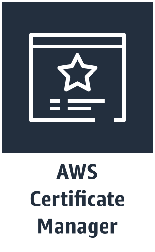</a>

*Monitoring and Updating*
- CloudWatch monitoring configured in the CloudFormation template.

*Docker Optimization*
- Switch from blind mounts to docker volumes. Determine if it’s possible to use the cloudstor add in to store volumes in ECS. The Docker documentation states that using volumes is preferred over blind mounts but using ECS for small projects appears to be less cost effective so I want to determine if this is feasible.

*Certificate Storage*
- Create an S3 bucket which contains the client certificate for easy access.

<a href="https://aws.amazon.com/s3/">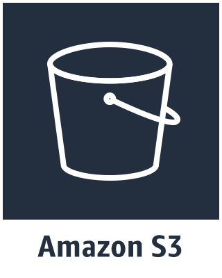</a>
---

## Reference

I'm using the following Docker containers in this project:
- [kylemanna/docker-openvpn](https://github.com/kylemanna/docker-openvpn)
- [pihole/pihole](https://github.com/pi-hole/docker-pi-hole)
- [v2tec/watchtower](https://github.com/v2tec/watchtower)

I found a number of valuable sources when researching this project:

- This issue describes how to configure split tunnel for DNS routing.
https://github.com/kylemanna/docker-openvpn/issues/288

- This is a 3 part series on creating an OpenVPN CloudFormation template and was the original base for my template.
https://zugdud.io/index.php/2017/11/16/automate-the-creation-of-a-basic-vpc-with-cloudformation/

- This is a pi-hole CloudFormation template that inspired me to containerize everything.
https://blog.observian.com/cloudformation-pi-hole-and-you